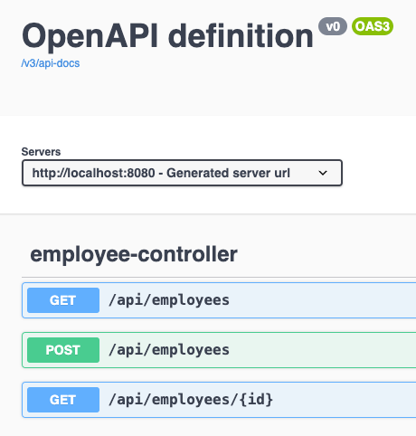

# thales-employees-sii-group
# PRUEBA TÉCNICA

Se realizó la implementación de la prueba técnica enviada, la cual se desarrolló de la siguiente forma:

## Tecnologías Utilizadas
- **BACK**: API RESTful JSON con Spring Boot.
- **JPA**: Utilizando base de datos H2.
- **JAVA**: Versión 17.
- **FRONT**: Angular 17 (Es necesario ejecutar `npm install` dentro de la carpeta del proyecto para instalar todas las dependencias necesarias en `node_modules`).

## Documentación
Se implementó **Swagger**. La documentación generada se puede acceder una vez que la API esté funcionando en el puerto indicado. Si es necesario, se debe actualizar el puerto en la dirección proporcionada: [http://localhost:8080/swagger-thales-service.html](http://localhost:8080/swagger-thales-service.html) para facilitar la comprensión y validación de los **ENDPOINTS** expuestos.

### Endpoints Implementados


## Acceso a la Base de Datos H2
Se puede acceder a la consola de H2 a través de la siguiente URL: [http://localhost:8080/h2-console](http://localhost:8080/h2-console). Recuerda que el puerto debe estar actualizado en la dirección si es diferente al 8080.
#### Nota: debe estar desplegado/activo el servicio para poder acceder a la ruta mencionada

### Credenciales de la Base de Datos H2
- **Usuario**: `sa`
- **Contraseña**: `password`

> **Nota**:
> - Se incluye un archivo denominado `thales-employees-sii-group-1.0.war`, el cual puede ser ejecutado si se tiene Java v17 instalado en el equipo. Para ejecutarlo, utiliza el siguiente comando en la consola/terminal:
>   ```bash
>   java -jar thales-employees-sii-group.war
>   ```
> - También se proporciona la carpeta del proyecto en formato ZIP.
> - Para el proyecto Angular, se incluye la carpeta `dist`, la cual contiene todo el código HTML, CSS, JS generado por la compilación (`ng build`), listo para ser desplegado en el servidor correspondiente.
> - No olvides ejecutar `npm install` en el proyecto Angular para regenerar la carpeta `node_modules` y que el proyecto funcione correctamente tanto en Windows como en Mac.

## Pruebas Unitarias
El proyecto back cuenta con pruebas unitarias.

## Repositorios en GitHub
Ambos proyectos (back y front) están disponibles en GitHub para su revisión y descarga funcional.